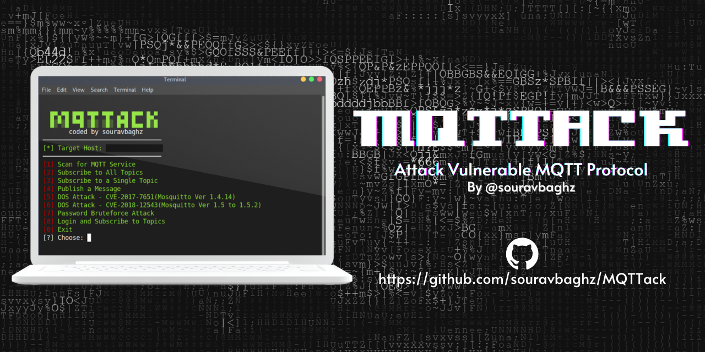

<p align="center">
  
</p>
<h1 align="center"><b>MQTTack</b></h1>


*** 
**NOTE:- This script only made for MQTT Service Port on 1883(Insecured). I will be not responsible if any user performs malicious activities using this script. Use it for Learning purpose only.**


### Installation Requirements :
 ```
 sudo apt-get install mosquitto-client
 git clone https://github.com/souravbaghz/MQTTack
 cd MQTTack && chmod +X src/MqttExploit
 ```
### Usage:
```
bash mqttack.sh host_IP
bash mqttack.sh 127.0.0.1
```
### Available Options Are:
 + [1] Scan for MQTT Service
 + [2] Subscribe to All Topics
 + [3] Subscribe to a Single Topic
 + [4] Publish a Message
 + [5] DOS Attack - CVE-2017-7651(Mosquitto Ver 1.4.14)
 + [6] DOS Attack - CVE-2018-12543(Mosquitto Ver 1.5 to 1.5.2)
 + [7] Password Bruteforce Attack
 + [8] Login and Subscribe to Topics
 + [0] Exit

***
 ### If you love my work then you can buy me a Coffee here.
 <a href="https://www.buymeacoffee.com/souravbaghz" target="_blank"></a>
 
 
 <br>

### 🤝 Connect with me
[](https://www.instagram.com/souravbaghz)
[](https://github.com/souravbaghz)
[](https://twitter.com/souravbaghz)
[](https://medium.com/@souravbaghz)

---
